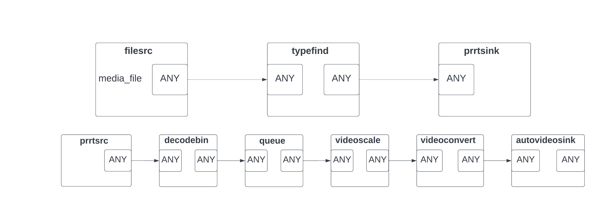
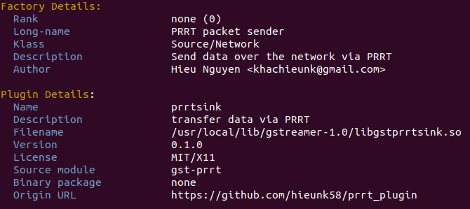
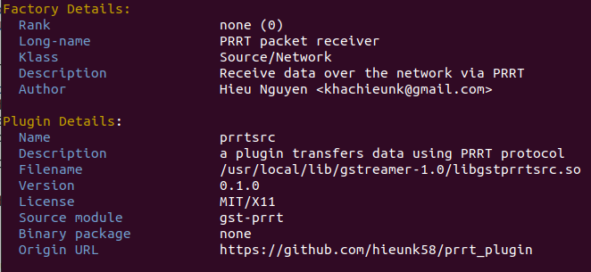

# PRRT GStreamer plugin

a GStreamer plugin using PRRT

## Overview

This project uses GStreamer framework to build two plugins that integrate PRRT protocol used for video streaming. Two plugins which are prrtsink and prrtsrc can be used inside a GStreamer pipeline to transfer any types of media contents. Plugin prrtsink acts as a sender and plugin prrtsrc acts as a receiver inside the pipeline.

Here is an example of using prrtsink and prrtsrc in a GStreamer pipeline:


## Prerequisites

Plugins in this project are only supported on Linux. To use plugins, you have to install GStreamer first. Follow the guide on this link [GStreamer](https://gstreamer.freedesktop.org/documentation/installing/on-linux.html?gi-language=c) to install all necessary packages.

## Installation

After downloading source codes from Github, go to that folder and pull the latest codes of PRRT protocol by running below command on terminal:

```
git submodule update --init --recursive
```

Next step is install our plugins. First, you need to change mode to executable for two files: install.sh and autogen.sh (inside folder plugin):

```
chmod +x install.sh
```

```
chmod +x plugin/autogen.sh
```

Then run file install.sh to generate Make file:

```
./install.sh
```

After that go to the folder plugin/src, run below command to install our plugins:

```
sudo make install
```

If everything is correct, two plugins prrtsink and prrtsrc will be installed in /usr/local/lib/gstreamer-1.0. Then we need to update GST_PLUGIN_PATH to the new folder that plugins are installed:

```
export GST_PLUGIN_PATH=/usr/local/lib/gstreamer-1.0
```

GStreamer supports gst-inspector to check whether our plugins registered successfully to the GStreamer framework after installation:

```
gst-inspector-1.0 prrtsink
```



```
gst-inspector-1.0 prrtsrc
```



## Usage

Here is an example of using two plugins prrtsink and prrtsrc to send a video with h264 encoding over the internet to the receiver.

Sender  

```
gst-launch-1.0 -v filesrc location=path/to/video ! qtdemux ! h264parse config-interval=-1 ! rtph264pay pt=96 name=pay0 ! prrtsink host=192.168.1.100 port=5000
```

Receiver  

```
gst-launch-1.0 -v prrtsrc port=5000 ! application/x-rtp ! rtph264depay ! avdec_h264 ! videoconvert ! textoverlay text="PRRT" valignment=top halignment=center font-desc="Sans, 16" ! ximagesink
```
